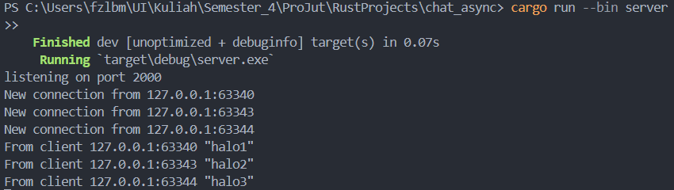
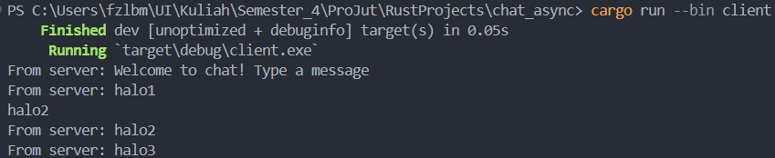
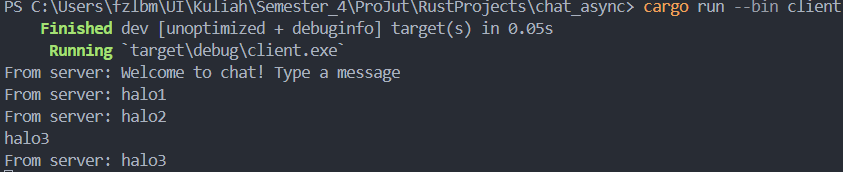
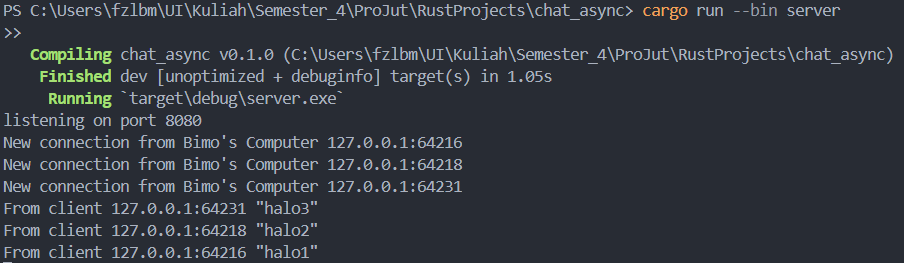
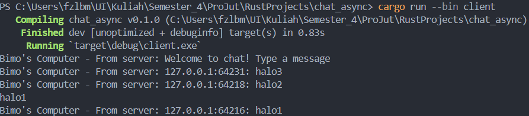
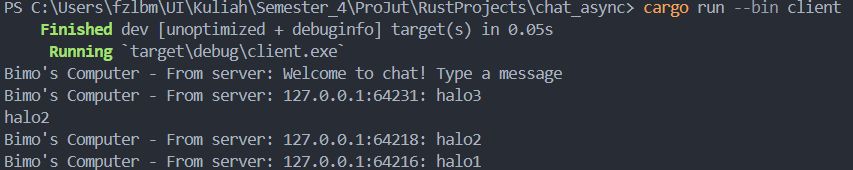

# Tutorial 2 Module 10

<details>
<summary>2.1. Original code of broadcast chat.</summary>

Server

Client-1

Client-2

Client-3


Kita perlu menambahkan kode di bawah ini pada `Cargo.toml`
```
[[bin]]
name = "server"

[[bin]]
name = "client"
```

Dengan itu, Cargo akan mengetahui bahwa ada beberapa target biner dalam proyek ini, yaitu server dan client. Dengan menspesifikasikannya dalam `Cargo.toml`, kita memberitahu Cargo untuk membangun eksekutor terpisah untuk masing-masing biner ini saat kita menjalankan `cargo build` atau `cargo run`.

Untuk menjalankan program, 

1. Navigasi ke direktori proyek yang berisi `Cargo.toml`.
2. Jalankan server dengan mengeksekusi `cargo run --bin server`.
3. Jalankan tiga _client_ dengan membuka tiga jendela terminal terpisah dan mengeksekusi `cargo run --bin client`.
4. Setiap _client_ akan terhubung ke server dan meminta kita untuk mengetikkan sebuah pesan/_chat_.
5. Ketikkan sebuah pesan di setiap terminal _client_ dan tekan _Enter_.
6. Amati bahwa pesan tersebut dikirim ke server yang kemudian menyiarkannya ke semua _client_ yang terhubung.
7. Kita akan melihat pesan yang diterima oleh setiap _client_, termasuk yang dikirim oleh dirinya sendiri.

Ketika kita mengetik pesan di setiap _client_, pesan tersebut dikirim ke server, yang kemudian menyiarkannya ke semua _client_ yang terhubung. Setiap _client_ menerima pesan yang disiarkan, termasuk pesan yang dikirimnya sendiri, sehingga terjadi interaksi mirip obrolan antara semua _client_.

</details>

<details>
<summary>2.2. Modifying the websocket port.</summary>

Ada beberapa hal yang perlu diubah agar dapat mengganti _port_ menjadi _port_ 8080,

#### `src/bin/server.rs`:
Ubah angka _port_ pada `TcpListener::bind`:

```
let listener = TcpListener::bind("127.0.0.1:8080").await?;
```

#### `src/bin/client.rs`:
Ubah URI untuk menghubungkan ke server pada port 8080:

```
let (mut ws_stream, _) =
    ClientBuilder::from_uri(Uri::from_static("ws://127.0.0.1:8080"))
        .connect()
        .await?;
```

### WebSocket Protocol:
Kedua server dan klien menggunakan protokol WebSocket, yang didefinisikan dan diimplementasikan dalam _crate_ `tokio_websockets`. _Crate_ ini menyediakan abstraksi dan utilitas yang diperlukan untuk bekerja dengan koneksi WebSocket dalam aplikasi berbasis Tokio. Protokol WebSocket memungkinkan komunikasi dua arah antara klien dan server melalui satu koneksi yang berlangsung lama.

Setelah melakukan modifikasi tersebut, kita dapat menjalankan server dan klien pada port 8080.

</details>

<details>
<summary>2.3. Small changes. Add some information to client.</summary>
Server


Client -1

Client - 2

Client - 3


Dalam implementasi sebelumnya, server hanya menyiarkan pesan yang diterima dari seorang klien tanpa informasi tambahan tentang pengirimnya. Begitu pula dengan klien yang menerima pesan dari server tanpa detail tentang siapa yang mengirim pesan tersebut.

Untuk menambahkan informasi tentang pengirim ke setiap klien, kita perlu memodifikasi baik server maupun klien:

#### Modifikasi Server
- Dalam kode server, saat menangani pesan dari seorang klien, kita perlu menambahkan informasi tentang pengirim (dalam hal ini, alamat IP dan _port_ klien) ke pesan sebelum menyiarkannya ke semua klien.
- Modifikasi ini memastikan bahwa setiap klien menerima pesan beserta detail tentang siapa yang mengirim pesan tersebut.

#### Modifikasi Klien
- Dalam kode klien, kita perlu mengekstrak dan menampilkan informasi pengirim bersama dengan konten pesan.
- Modifikasi ini memungkinkan setiap klien menampilkan pesan bersama dengan detail tentang pengirim, memberikan konteks tentang asal setiap pesan.

Dengan melakukan perubahan ini baik dalam kode server maupun klien, kita memastikan bahwa informasi tentang pengirim disertakan dan ditampilkan dengan benar dalam aplikasi obrolan. Penting untuk memodifikasi kedua sisi komunikasi untuk menjaga konsistensi dan memastikan bahwa setiap klien menerima dan menampilkan pesan dengan informasi pengirim secara akurat.

</details>
